# JAVA Full Stack Projects
# 📝 List Todos App

A full-stack Todo application using **Spring Boot (Backend)** and **React (Frontend)**, demonstrating full **CRUD (Create, Read, Update, Delete)** functionality.

---

## 🔗 GitHub Repositories

- ⚙️ **Backend (Spring Boot)**: [List Todos Backend](https://github.com/ramachandraaa/TodoFullStack)
- 🎨 **Frontend (React)**: [List Todos Frontend](https://github.com/ramachandraaa/front-Dev)

---

## 📸 CRUD Operation Screenshots

> Images of each CRUD operation from the frontend.

### ➕ Create Todo
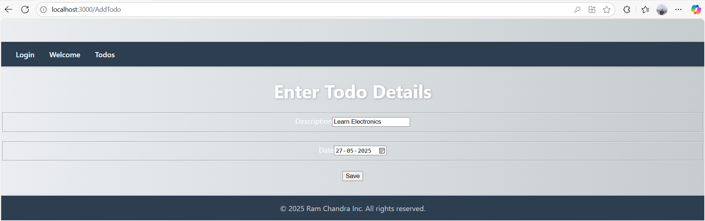

### 📋 Read Todos
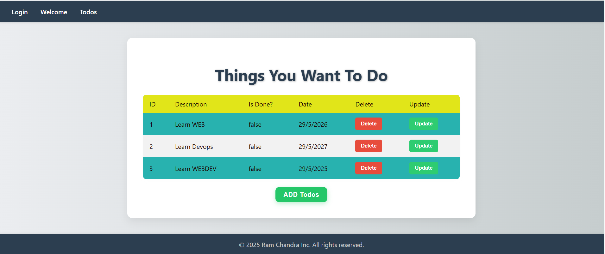

### ✏️ Update Todo
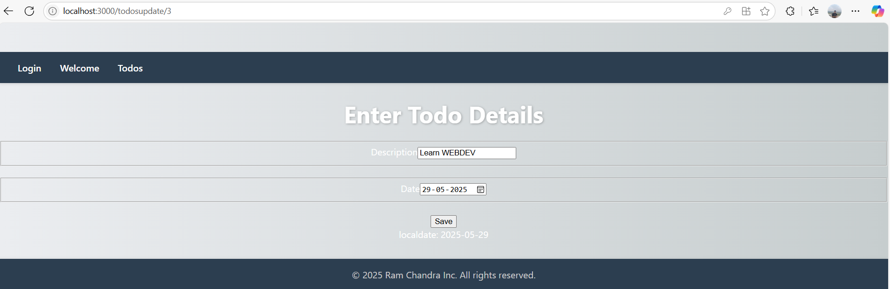

### ❌ Delete Todo
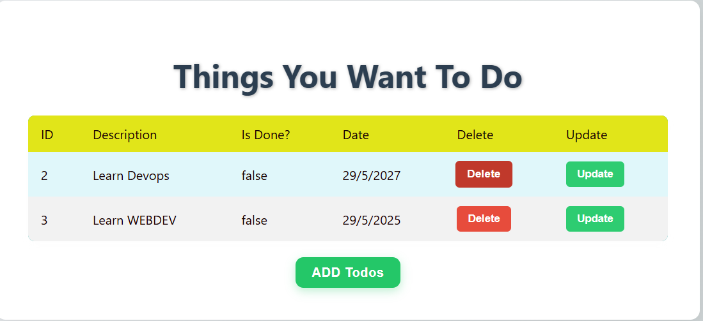

### 📋 After Adding New Todo
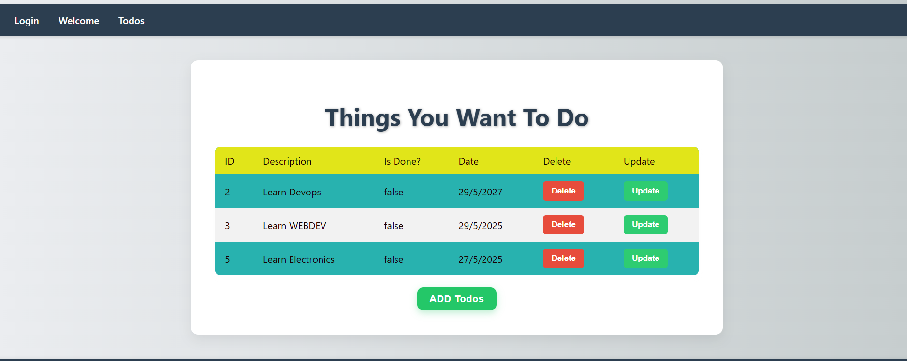

---

## 🛠️ Tech Stack

- **Frontend:** React, Axios, Bootstrap/Tailwind (optional)
- **Backend:** Spring Boot, Spring Data JPA, Spring Web
- **Database:** MySQL / H2

---

## 🚀 Features

- Add, edit, delete, and view todos
- Full integration between frontend and backend via REST APIs
- Responsive and clean UI
- Component-based architecture

---

## 📦 Setup Instructions

### 🔧 Backend (Spring Boot)

1. Clone the backend repo:
    ```bash
    git clone https://github.com/ramachandraaa/TodoFullStack
    cd TodoFullStack
    ```

2. Configure your database in `src/main/resources/application.properties`.

3. Build and run:
    ```bash
    mvn clean install
    mvn spring-boot:run
    ```

4. Backend runs at: `http://localhost:8080`

---

### 🎨 Frontend (React)

1. Clone the frontend repo:
    ```bash
    git clone https://github.com/ramachandraaa/front-Dev
    cd list-todos-frontend
    ```

2. Install dependencies:
    ```bash
    npm install
    ```

3. Start the frontend:
    ```bash
    npm start
    ```

4. Frontend runs at: `http://localhost:3000`

> ⚠️ Make sure CORS is enabled in the backend if accessing from a different origin.

---

# Spring Security with JWT and BCrypt

This project demonstrates the implementation of **Spring Security** with enhanced security using **BCryptPasswordEncoder** for password hashing and **JWT (JSON Web Token)** for stateless authentication and authorization.

GitHub Repository: [[BackendRepoJwt](https://github.com/ramachandraaa/SpringJwt)]

## 🔐 Features

* User authentication with JWT token generation.
* Secure password storage using BCrypt.
* Stateless authentication using JWT in headers.
* Token validation and role-based authorization.
* Custom exception handling for security events.
* Secure endpoints with fine-grained access control.

## ⚙️ Tech Stack

* Java 17+
* Spring Boot
* Spring Security
* Spring Web
* Spring Data JPA (optional)
* H2 / MySQL (for persistence, optional)
* JWT (io.jsonwebtoken - JJWT)
* BCryptPasswordEncoder

## 📦 Setup Instructions

1. **Clone the Repository**

   ```bash
   git clone https:https://github.com/ramachandraaa/SpringJwt
   cd SpringJwt
   ```

2. ## Configuration

Below is the `application.properties` configuration required for the project:

```properties
# Server Configuration
server.port=8080

# JWT Configuration
jwt.secret=your_jwt_secret_key
jwt.expiration=3600000  # 1 hour in milliseconds

# Database Configuration
spring.jpa.defer-datasource-initialization=true
spring.jpa.hibernate.ddl-auto=update
spring.datasource.url=jdbc:mysql://localhost:3306/todos
spring.datasource.username=todos-user
spring.datasource.password=dummytodos
spring.jpa.properties.hibernate.dialect=org.hibernate.dialect.MySQL8Dialect

   ```

## 🔑 Authentication Flow

1. **User Registration** (POST `/register`)

   * Password is encoded using `BCryptPasswordEncoder`.

2. **Login** (POST `/login`)

   * On success, returns a JWT in the response.

3. **Secure API Call** (GET `/students`) an Example call 

   * JWT must be passed in the `Authorization` header as:

     ```
     Authorization: Bearer <your_token>
     ```

## 📁 Key Files Overview

| File                           | Description                                                    |
| ------------------------------ | -------------------------------------------------------------- |
| `SecurityConfig.java`          | Configures authentication manager, filters, and security rules |
| `JwtUtil.java`                 | Handles JWT token creation, parsing, and validation            |
| `AuthController.java`          | REST controller for login and registration                     |
| `UserDetailsServiceImpl.java`  | Loads user details from the database                           |
| `JwtAuthenticationFilter.java` | Intercepts requests to validate JWT tokens                     |
| `BCryptPasswordEncoder`        | Bean used to hash passwords securely                           |

## 🧪 Sample API Usage

### Register

```json
POST /register
{
  "username": "john",
  "password": "password123"
}
```

### Login

```json
POST /login
{
  "username": "Sujal",
  "password": "S@2005"
}
```

#### Response

```json
{
  "token": "eyJhbGciOiJIUzI1NiIsInR5cCI6IkpXVCJ9..."
}
```

### Secure Access

```
GET /students
Authorization: Bearer <your_token>
```

## 📸 Screenshots
### Register 

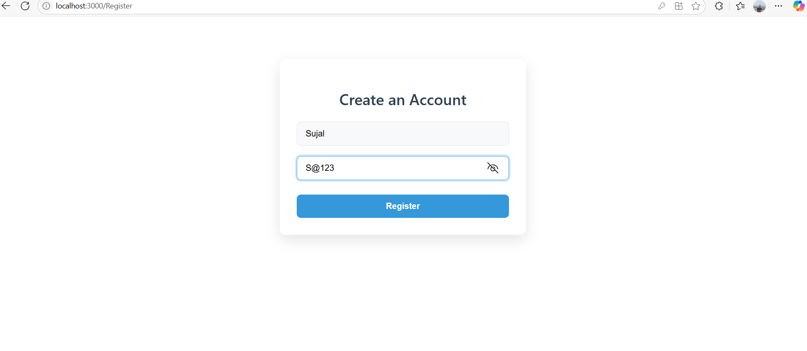

### Login 

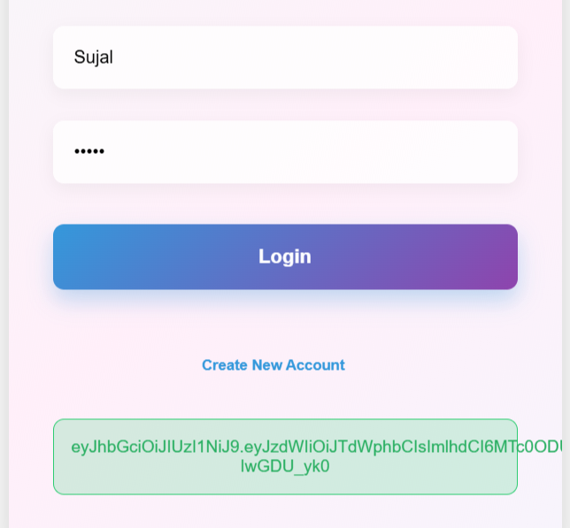

### BCrypt encoder 

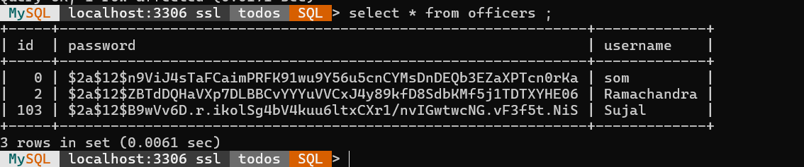

### Login With Postman 
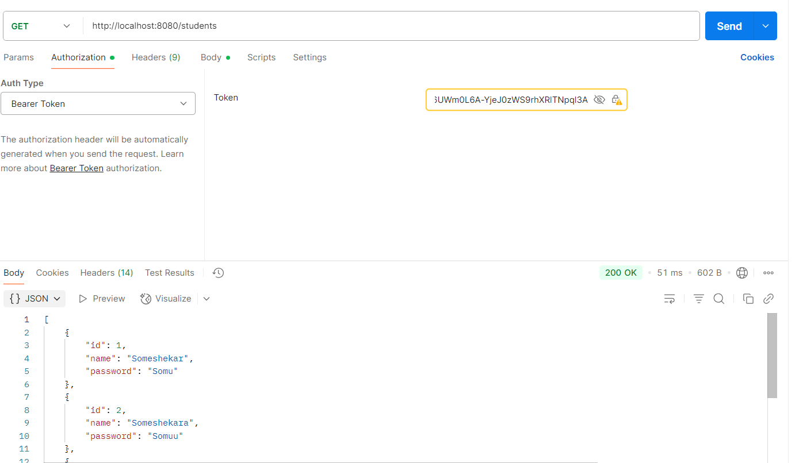

### Register With Postman 
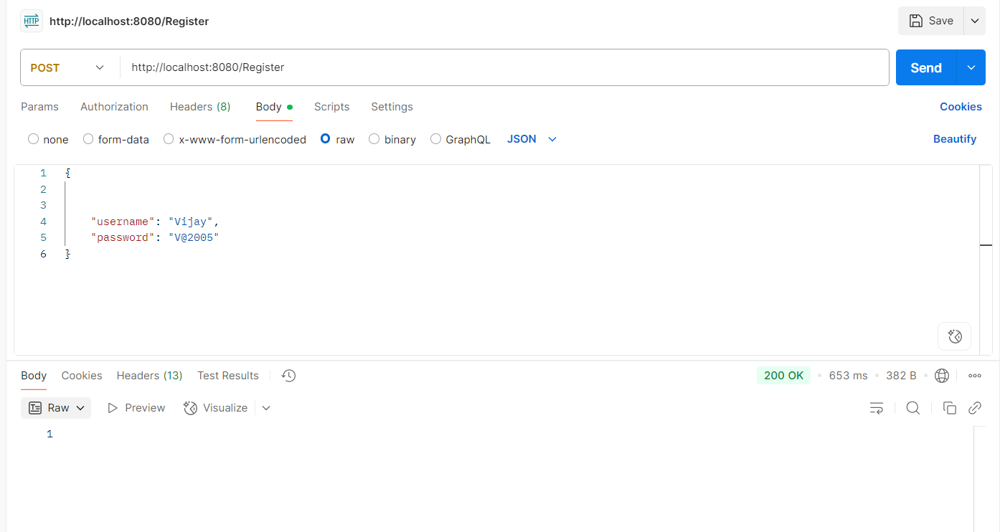

### JWT Token Generated

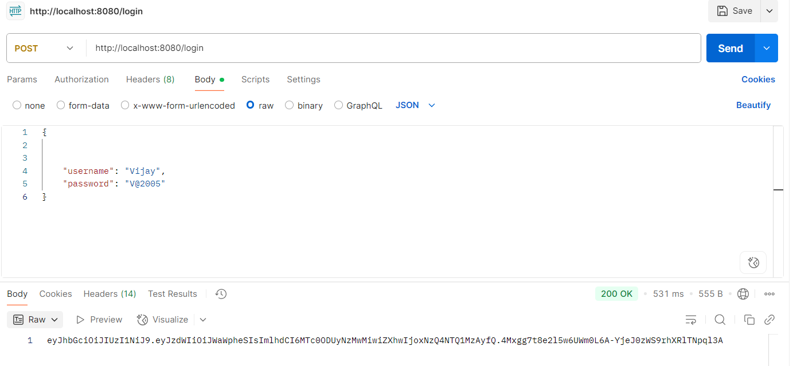

### Access Secure Endpoint with Token


### JWT Invalid/ExpiredToken

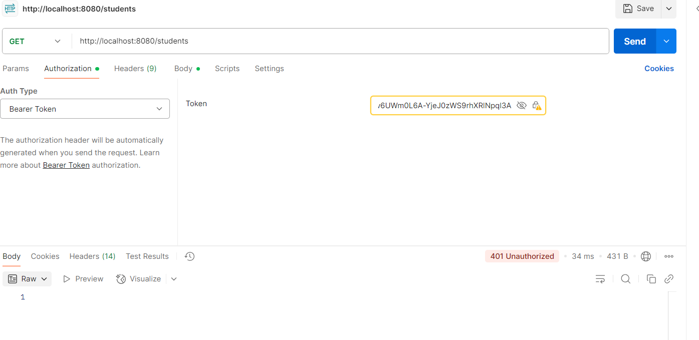

## ✅ Security Highlights

* ✅ Passwords stored using one-way BCrypt hashing.
* ✅ Stateless JWT authentication—no session storage.
* ✅ Secure endpoints with role-based access control.
* ✅ JWTs include expiration to prevent reuse.


